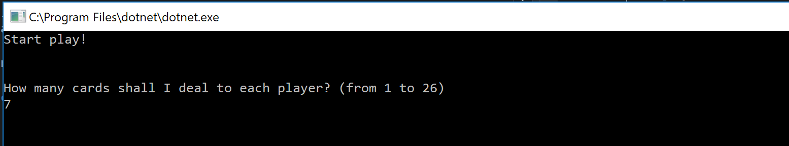
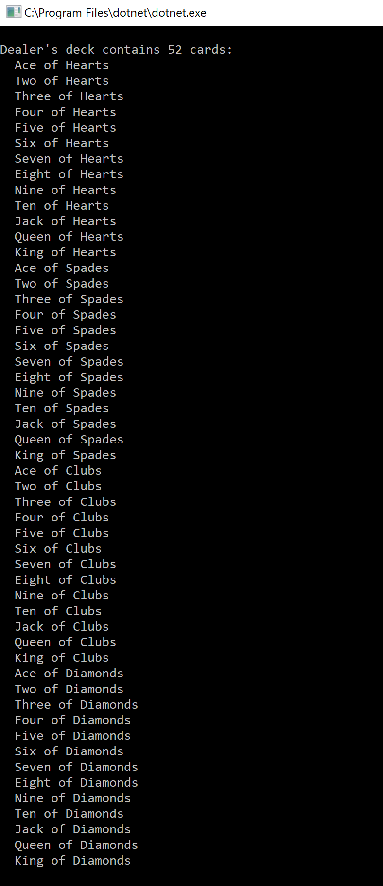
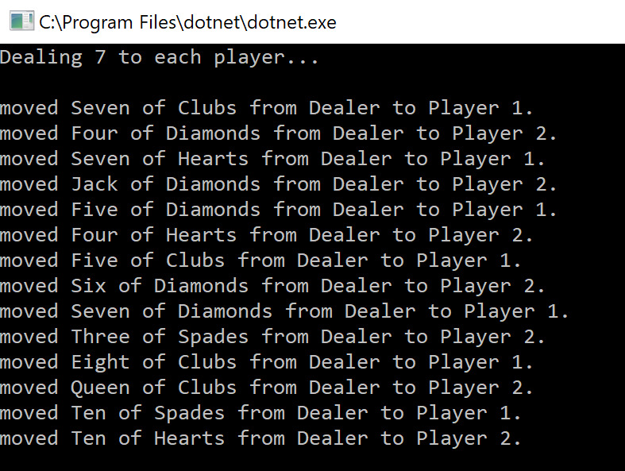
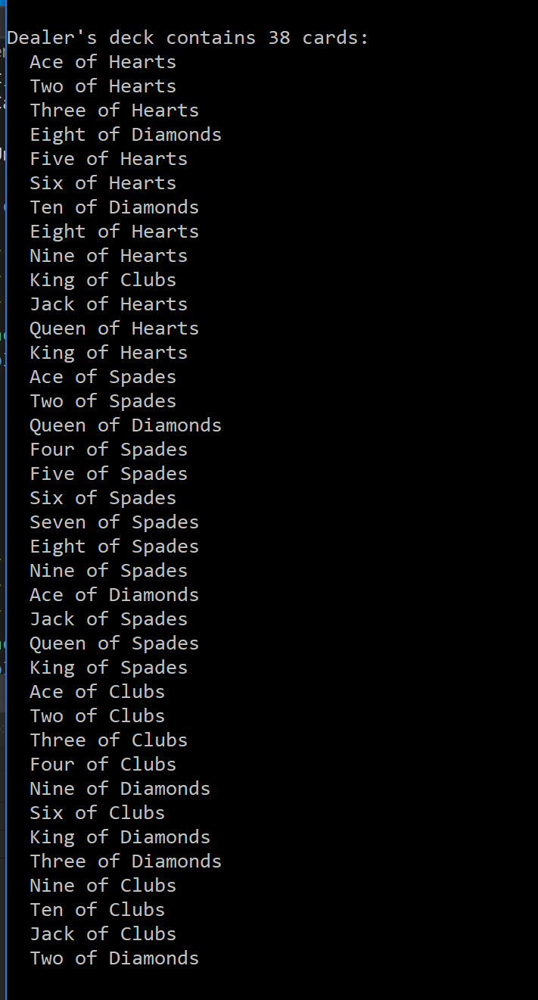
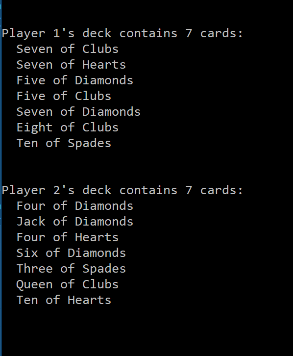

# LAB07-Collections
CF401 Lab 7: Collections (C# console app)

## Background and Introduction
This project builds a new anonymous collection and a custom class to populate the collection. It uses these components to simulate a deck of cards moving between a dealer deck and 2 player decks.

## Classes and Their Interaction/Usage
At launch, the user is prompted to enter the of number of cards to deal, which is used to build a Game object (another custom class). The game object enables initial dealer deck build (standard 52 card deck) using the Dealer collection (implements IEnumerable). Program class initializes 2 empty player decks, and cards are 'dealt' by selecting them at random from the dealer deck to each player in turn - the 'moves' are completed by Deck class methods:
  SelectRandom() selects a card at random from a deck
  Add(Card) adds a card to a deck
  Remove(Card) replaces the specified card in a deck with the card at the end of the deck and moves the counter left 1 slot (to avoid blanks in the array or array-counter mismatch)
Confirmation of deck states and all changes to decks are displayed on the console, along with deck counts and contents (see images below):

IMAGE: Launch screen with user entry

IMAGE: Dealer deck is initialized and populated with all 52 cards

IMAGE: Individual card moves during deal of user specified number of cards

IMAGE: Dealer deck after deal

IMAGE: Player decks after deal

## Testing
Tests confirm that objects and collections are properly instantiated, that properties are accessible for get/set (as appropriate), and that cards can be added and deleted (when present).

